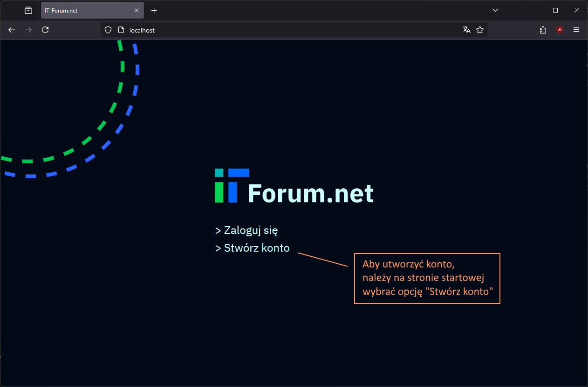
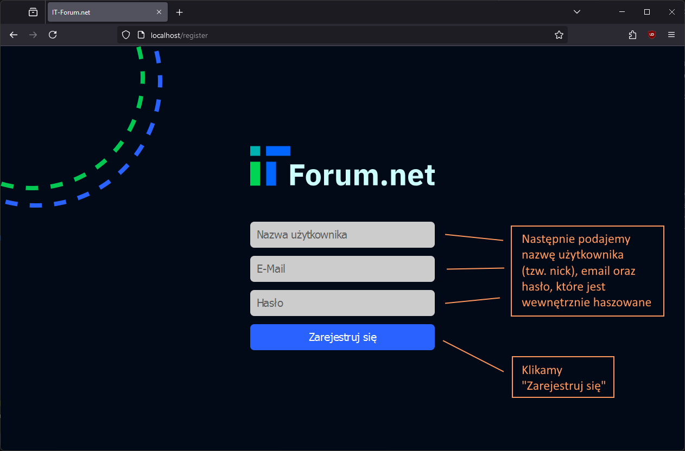
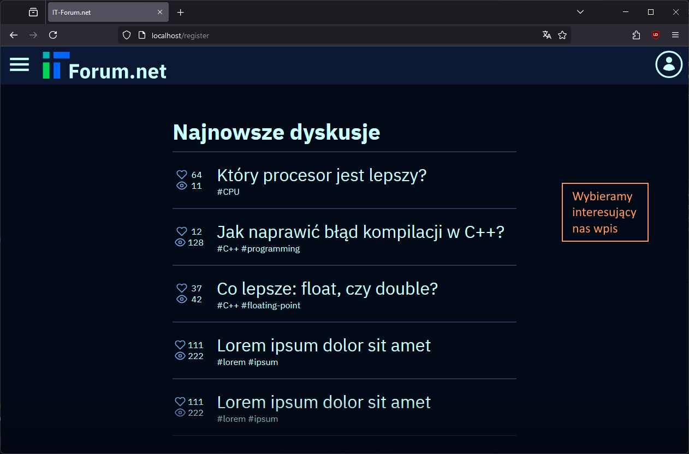
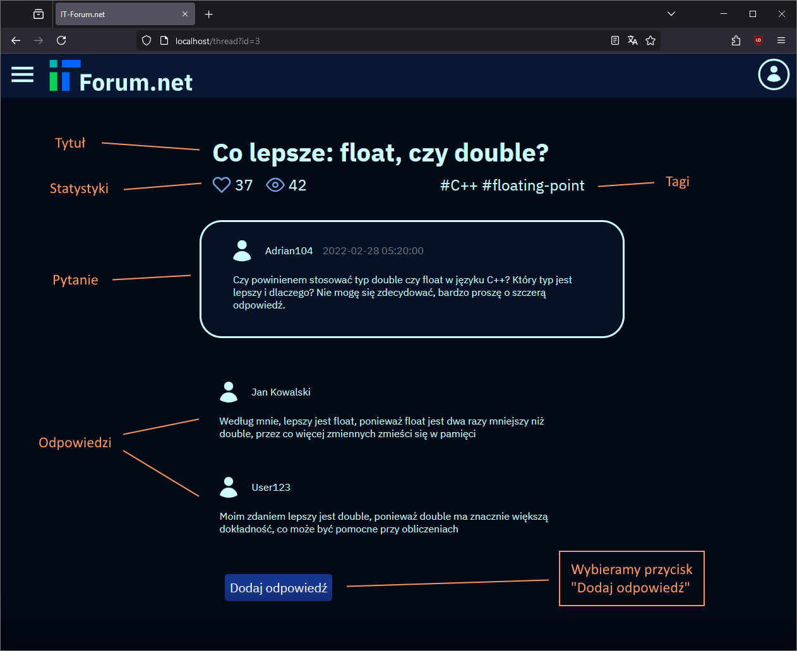
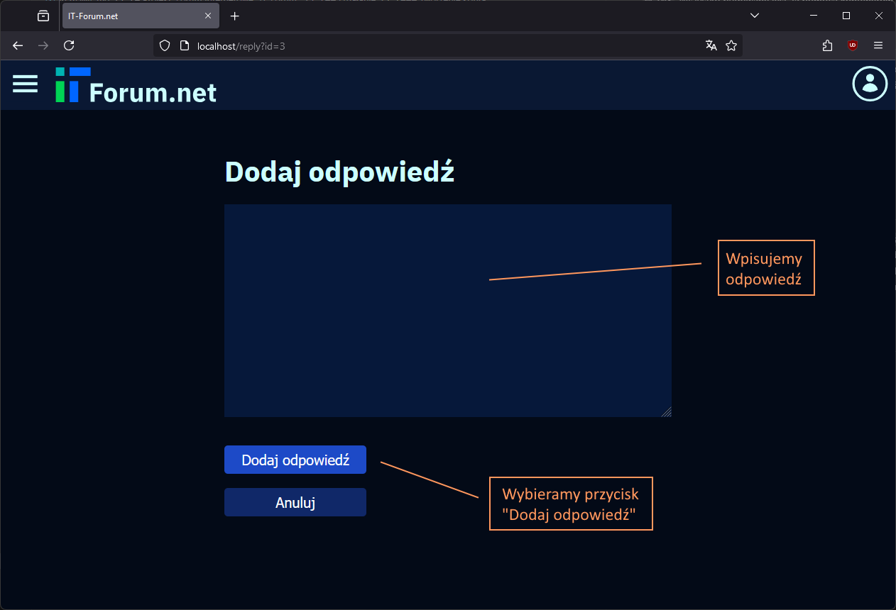
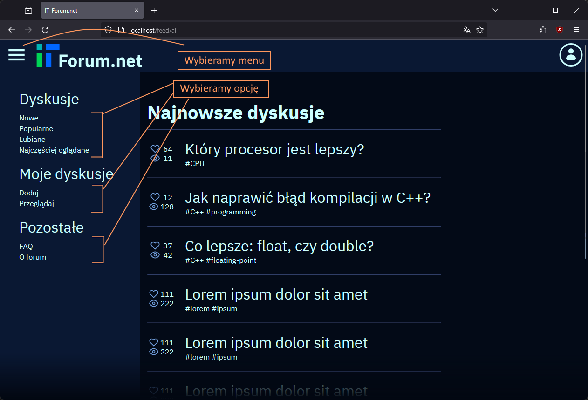
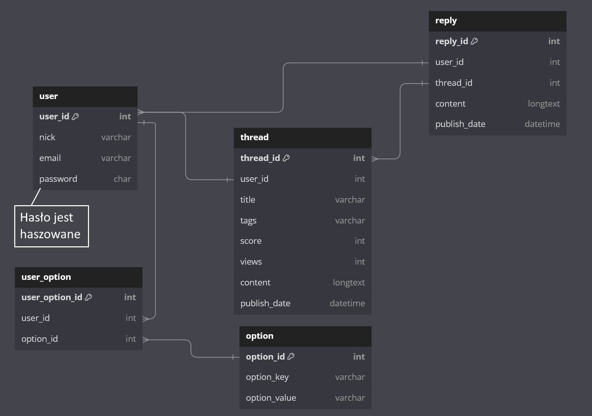

# Projekt: Forum internetowe "IT-Forum"
Niniejsze repozytorium zawiera projekt, który wykonałem na przedmiot "Wstęp do Projektowania Aplikacji Internetowych". Moim tematem pracy było stworzenie forum, gdzie użytkownicy będą mogli prowadzić konwersacje na zadane tematy, z zakresu informatyki.

## Zastosowane technologie
* HTML
* CSS
* PHP
* SQL
* JavaScript

Jako silnik bazodanowy wybrałem `MariaDB`, ponieważ pracowałem już z nim wcześniej. Serwerem HTTP jest `NGINX`. Wszystko budowane jest za pomocą kontenerów `Docker`.

## Prototypy
Prototypy aplikacji wykonałem w wolnym i otwarto-źródłowym programie `Inkscape`. Jest to program do grafiki wektorowej. Mam z nim zdecydowanie większe doświadczenie, niż w przypadku aplikacji `Figma`.  
  
Łącznie przygotowałem 10 prototypów: 5 desktopowych i 5 mobilnych. Poniżej znajdują się linki:

[Prototypy desktopowe](concept-desktop.md)  
[Prototypy mobilne](concept-mobile.md)  
[Pliki SVG programu Inkscape](resources/concept)

## Uruchomienie
Aby uruchomić projekt, wystarczy wpisać `docker compose up` w wierszu poleceń będąc w repozytorium. Proces budowania kontenerów może zająć kilka minut. Gdy kontenery zostaną już uruchomione, wystarczy wpisać `localhost` do przeglądarki internetowej - wszystkie adresy IP oraz porty są ustawione na domyślne. Całość testowałem w przeglądarce Firefox, ale myślę, że projekt powinien również dobrze działać na innych przeglądarkach (np. tych bazujących na Chromium).

## Działanie
### Tworzenie konta

### Dodawanie odpowiedzi

### Wybieranie opcji z menu

## Diagram ERD
